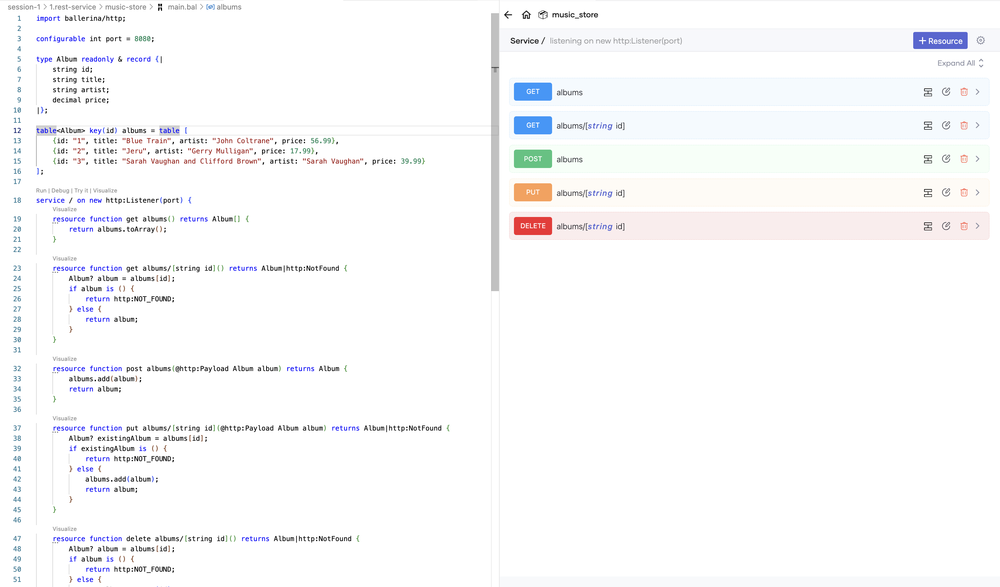
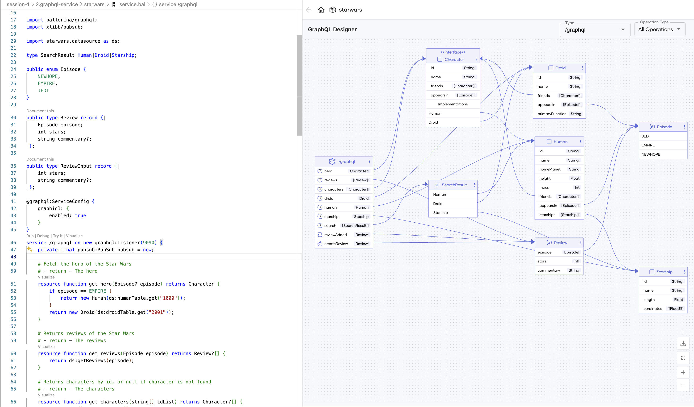
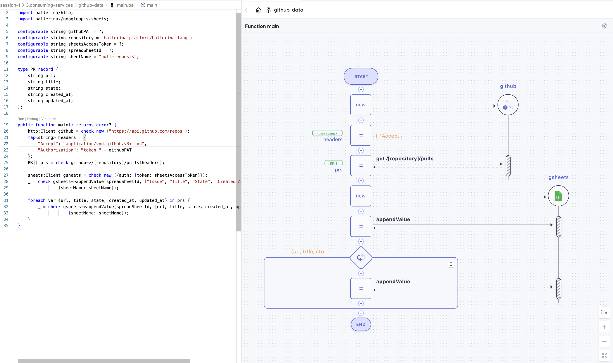
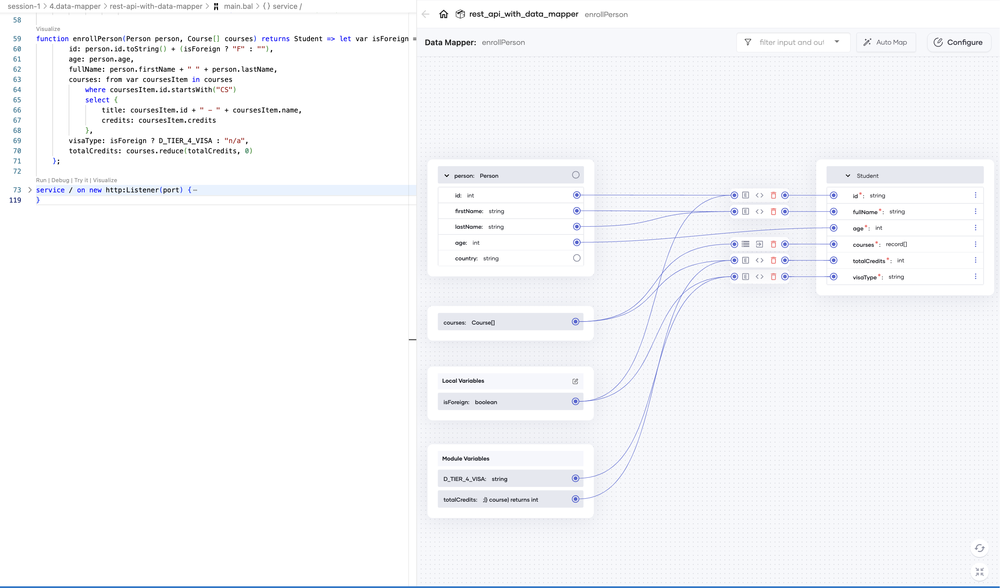

# Session 1

## Download and install Ballerina

1. Latest version of [Ballerina Swan Lake](https://ballerina.io/downloads/)
2. [Visual Studio Code](https://code.visualstudio.com/)
3. [Ballerina VS Code extension](https://ballerina.io/learn/vs-code-extension/?utm_source=flyer&utm_medium=talk&utm_campaign=devrel&utm_term=sikkimsessions)

## Samples

### 1. REST service with Ballerina

**Sample code:**[1.rest-service](./1.rest-service/)



Run the sample using `bal run` command. 

**Test the application**

Sample request: 

```bash
curl "http://localhost:8080/albums"
```

Sample response:

```json
[
  {
    "id": "1",
    "title": "Blue Train",
    "artist": "John Coltrane",
    "price": 56.99
  },
  {
    "id": "2",
    "title": "Jeru",
    "artist": "Gerry Mulligan",
    "price": 17.99
  },
  {
    "id": "3",
    "title": "Sarah Vaughan and Clifford Brown",
    "artist": "Sarah Vaughan",
    "price": 39.99
  }
]
```


### 2. GraphQL service with Ballerina

**Sample code:** [2.graphql-service](./2.graphql-service/)



Run the sample using `bal run` command.

**Test the application:**

Open the GraphiQL client in http://localhost:9090/graphiql

Sample query: 

```graphql
query {
    hero(episode: EMPIRE) {
        ...on Human {
            name
            homePlanet
            friends {
                ...on Droid {
                    name
                    primaryFunction
                }
            }
        }
    }
}
```

Sample response:

```json
{
  "data": {
    "hero": {
      "name": "Luke Skywalker",
      "homePlanet": "Tatooine",
      "friends": [
        {},
        {},
        {
          "name": "C-3PO",
          "primaryFunction": "Protocol"
        },
        {
          "name": "R2-D2",
          "primaryFunction": "Astromech"
        }
      ]
    }
  }
}
```

### 3. Consuming services

**Sample code:** [3.consuming-services](3.consuming-services/)



### 4. Data mapper

**Sample code:** [4.data-mapper](4.data-mapper/)

