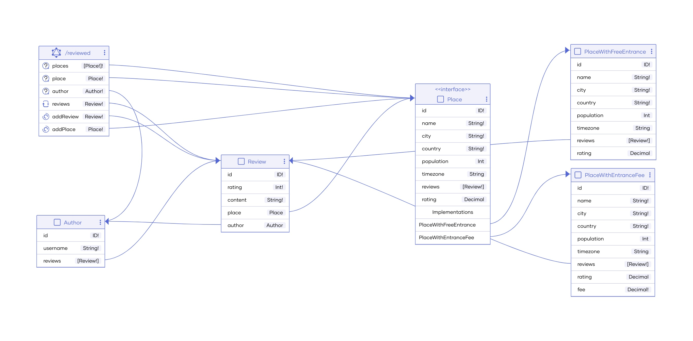

# Session 3

## Overview 

- GraphQL with Ballerina
- Testing Ballerina code
- Ballerina connectors and package management
- Observability with Ballerina

These areas will be covered via an implementation of a GraphQL backend in Ballerina, for `Reviewed!`, a platform to review places.

## Backend implementation for `Reviewed!`

`Reviewed!` let's you 
- retrieve all places for which reviews can be done, with city, country, rating, and fee
- retrieve details of a specific place, including city, country, rating, fee, time zone, city population, and all the current reviews for the place
- retrieve all the reviews by a particular author
    - a review consists of a rating and review content for a particular place

### GraphQL diagram generated by Ballerina



### Developing the GraphQL backend

#### Level 0 - Initial data

- Branch - https://github.com/wso2con2024/ballerina-tutorial/tree/session-3-level-0

- Consists of in-memory data to get started with the GraphQL implementation.

- Three main entities: Place, Author, and Review

    

- Use this to implement level 1.

    i. return all places with data in the places table - id, name, city, country, and entryFee

    ii. incorporate population and time zone information from https://public.opendatasoft.com/explore/dataset/geonames-all-cities-with-a-population-500/api/?disjunctive.country 

    - URL - https://public.opendatasoft.com/api/explore/v2.1/catalog/datasets
    - path - string `/geonames-all-cities-with-a-population-500/records?refine=name:${
        city}&refine=country:${country}` 

#### Level 1 - Record as output type

- Branch - https://github.com/wso2con2024/ballerina-tutorial/tree/session-3-level-1

- Consists of the GraphQL service implementation to retrieve `places` with additional city information, with records as output object types.

- But records, may not always be ideal if additional work is done to resolve fields, since it will be unnecessary if such a field is not requested. Similarly, records aren't ideal when there are relationships between objects and each object needs to be accessible via the other (e.g., review via place and place via review). For level 2, we will change record output type to an object output type.

#### Level 2 - Object as output type

- Branch - https://github.com/wso2con2024/ballerina-tutorial/tree/session-3-level-2

- Consists of the GraphQL service implementation to retrieve `places` with additional city information, but with Ballerina service objects as output object types.

    This change ensures additional work is done if and only when requested.
    
    > Note: even with this approach, the remote method call for a city is repeated when both the population and the time zone are requested. Similarly, the calls are repeated when there are multiple places in the same city. Ballerina supports data loaders to avoid this - incorporated in Level 8.

- Demonstrates how types that include nil translate to allowing partial data to be returned even when a particular field cannot be resolved.

- For level 3, let's 

    i. introduce the rest of the output objects - `Author` and `Review`

    ii. introduce a query that accepts arguments (`place` to retrieve place data for a given place ID)

#### Level 3 - Introduce object types with relationships and queries with arguments

- Branch - https://github.com/wso2con2024/ballerina-tutorial/tree/session-3-level-3

- Consists of objects for Review and Author and introduces the relationships.

- Also introduces the `place` query that accepts the place ID as an argument and to expose place information relevant to the place with the given ID. 

- As the next step (level 4), let's add a mutation operation, to add a new review.

#### Level 4 - Introduce a mutation operation to add a review

- Branch - https://github.com/wso2con2024/ballerina-tutorial/tree/session-3-level-4

- Introduces a mutation operation, which is the GraphQL way of performing an update.

- Also introduces records as GraphQL input object types to accept structured input.

- Now that we have updates, next (level 5), let's introduce a subscription operation, the GraphQL way for real-time, continuous updates. Let's introduce a subscription for reviews for a particular place.

#### Level 5 - Introduce a subscription operation to receive updates when new reviews are added

- Branch - https://github.com/wso2con2024/ballerina-tutorial/tree/session-3-level-5

- Introduces a subscription operation, to receive real-time, continuous updates.

- The Ballerina GraphQL module comes with built-in support for subscriptions. Just requires a `subscribe` resource method with a `stream` return type. 

    Maintains a WebSocket connection to push updates.

- Now that we have the operations set up, next (level 6), let's look at how some Ballerina features directly map to GraphQL concepts. We've already seen nullability in use. Let's now look at interfaces and unions.

    Assume, some places require an entry fee to be paid while the others do not. We can have two concrete representations of places:

    i. `PlaceWithFreeEntrance` to represent places with free entrance, with the exact fields we have in the current `Place` type 

    ii. `PlaceWithEntranceFee` to represent places with an entrance fee, which has an `entranceFee` field in addition to the fields in the current `Place` type

    Both interfaces and unions in GraphQL (and Ballerina) allow returning one of multiple values.

    i. An interface specifies fields that multiple objects can include. Therefore, queries can be based on the interface. Additionally, implementations of the interface can return additional fields, which can be queried against the specific implementation types.

    ii. A union specifies the possible types that can be returned. Unlike interfaces, unions don't have shared fields, and therefore, are most suitable when there's little to no common fields among the objects.

    Ballerina's object type can be used as an interface and union types are both syntactically and semantically similar to GraphQL union types.

#### Level 6 - Introduce an interface for Place

- Branch - https://github.com/wso2con2024/ballerina-tutorial/tree/session-3-level-6

- Introduces an interface for `Place` with two implementations - `PlaceWithFreeEntrance` and `PlaceWithEntranceFee`. `PlaceWithEntranceFee` additionally exposes a `fee` field.

    Ballerina requires `distinct` objects (which is Ballerina's way of allowing nominal type-like behaviour) with interfaces and unions to differentiate between the possible return types.

- Now that we're done with the core service implementations, next (level 7), let's introduce

    i. a Ballerina GraphQL client to consume this service

    ii. tests for the implementation

#### Level 7 - Use a Ballerina GraphQL client and add tests for the implementation

- Branch - https://github.com/wso2con2024/ballerina-tutorial/tree/session-3-level-7

- Introduces a [GraphQL client sample](./graphql_client.bal) demonstrating how a Ballerina GraphQL client can be used with a GraphQL server.

- Introduces tests using the [Ballerina's built-in test framework](https://ballerina.io/learn/test-ballerina-code/test-a-simple-function/).

    - Import the `ballerina/test` module to use the test framework. Supports assertions, before, after, etc. functions, grouping, and more.

    - Extensive support for [client and service testing](https://ballerina.io/learn/test-ballerina-code/test-services-and-clients/), including support for [mocking](https://ballerina.io/learn/test-ballerina-code/mocking/), that enables mocking remote calls.
    
    - Tests are run using the `bal test` command.

        `bal test --test-report --code-coverage`

        - The `--test-report` option generates a test report

        - The `--code-coverage` option utilizes the built-in support for code coverage to include coverage information in the report

        - See [code coverage and reporting](https://ballerina.io/learn/test-ballerina-code/code-coverage-and-reporting/).

- Now that we are done with the core implementation, let's take it to the next level (level 8), introducing features such as data loaders (for batching and caching) and authorization and integrating data persistence.

#### Level 8 - A complete backend implementation

- Branch - https://github.com/wso2con2024/ballerina-tutorial/tree/session-3-level-8

Now that we have the core implementation done, we can work on incorporating a few advanced concepts and features.

- Note that, in this version, we've switched to use data from a database instead of the in-memory tables. The [Ballerina persist feature](https://ballerina.io/learn/bal-persist-overview/) has been used as an interface to the underlying database.

    To run this locally, first

    i. Use [script.sql](./reviewed/modules/db/script.sql) to create the database tables and populate the initial data.

    ```bash
    $ mysql -u <USERNAME> -p < <PATH_TO_SCRIPT>/script.sql
    ```

    ii. Add the database configuration similar to the following in a file named `Config.toml` in the working directory, to provide values for the configurable variables to establish the database connection.

    ```toml
    [reviewed.db]
    host = "localhost"
    port = 3306
    user = "user"
    password = "password"
    database = "reviewed_db"
    ```

- Filtering and sorting - the `places` query has been updated to allow filtering by city and/or country and sorting by name or rating. These are defaultable parameters, making the arguments optional in the actual queries.

- Maximum query depth - introduced in the service annotation, this restricts the depth of the query to avoid unnecessary processing for abnormal/malicious queries.

- Data loaders - Ballerina supports data loaders that allow avoiding the GraphQL N + 1 problem via batching and caching. In this version, we've only introduced the data loader for the city data retrieval calls, but we can introduce data loaders for database access too. Also see [GraphQL data loader](https://ballerina.io/learn/by-example/graphql-dataloader/).

- Enabling SSL - set the relevant `secureSocket` configuration when creating the listener. Also see [GraphQL service security](https://ballerina.io/learn/by-example/#graphql-service-security).

- Field-level authorization - a simple (hard-coded) user ID-based authorization has been introduced to the `addPlace` mutation. The user ID from a request header is set to [the GraphQL context](https://ballerina.io/learn/by-example/graphql-context/), which is then accessed at field-level via a [field interceptor](https://ballerina.io/learn/by-example/graphql-field-interceptors/) to check if the user is authorized to add a place.

- Constraint validation - [GraphQL input constraint validation](https://ballerina.io/learn/by-example/graphql-input-constraint-validation/) has been introduced using the `ballerina/constraint` module to validate that the rating is a value between 1 and 5, inclusive.

- Schema generation - Now that the service implementation is done, we can generate the GraphQL schema using the `bal graphql` command.

    ```bash
    reviewed$ bal graphql -i service.bal -o schema/
    SDL Schema(s) generated successfully and copied to :
    -- schema_reviewed.graphql
    ```

    This will generate the schema at the specified [output path](./reviewed/schema/schema_reviewed.graphql).

- Note: If you want to enable GraphiQL and/or introspection, add the following also in the config file.

    ```toml
    graphiqlEnabled = true
    introspection = true
    ```

  For demonstration, to reset the database tables to the initial state on start up (as when the script was executed), you can set `reset` to `true`.  

- For an overview of these and other Ballerina GraphQL features, see Ballerina GraphQL examples:

    - [GraphQL service](https://ballerina.io/learn/by-example/#graphql-service)
    - [GraphQL service advanced](https://ballerina.io/learn/by-example/#--graphql-service-advanced)
    - [GraphQL service security](https://ballerina.io/learn/by-example/#graphql-service-security)
    - [GraphQL client](https://ballerina.io/learn/by-example/#graphql-client)
    - [GraphQL client security](https://ballerina.io/learn/by-example/#graphql-client-security)


