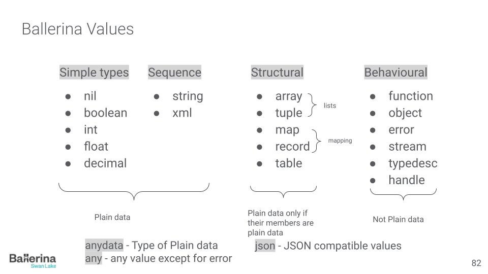

# Ballerina Data Values

This sessions is dedicated to exploring the plain data. Each provided example demonstrates the fundamental data types and structures in Ballerina, showcasing why it is an effective language for handling data as data.

## What is Plain Data?

**Network data** is the data that is independent of any specific code operating on the data. This data is typically exchanged through network interfaces between programs. In Ballerina, this is known as plain data.

Plain data is a fundamental concept in Ballerina. It is a data type that is not associated with any specific code. This means that the data can be passed around and manipulated without any restrictions. 

In Ballerina, plain data is represented in its shape. Ballerina provides right set of abstraction to represent data, manipulate data and pass data around in harmony with the network data.

## Ballerina Values

## Contents

Each file in this repository corresponds to a specific aspect of Ballerina's data handling capabilities. Below are brief descriptions of what each file covers:

### Boolean
- **01_boolean.bal**
  - About good old boolean values.

### Numeric Types
- **02_int.bal**
  - Usage of integers.
- **04_float.bal**
  - Handling floating-point numbers.
- **05_decimal.bal**
  - Working with decimal numbers.
- **06_numeric_types.bal**
  - Overview of all numeric types in Ballerina.

### Strings and Collections
- **07_strings.bal**
  - String manipulation and functions.
- **08_arrays.bal**
  - Array operations and examples.
- **09_tuples.bal**
  - Using tuples for grouping different types.
- **10_maps.bal**
  - Map collections and operations.
- **11_records.bal**
  - Introduction to records.
- **12_closed_records.bal**
  - Exploring closed records.
- **13_tables.bal**
  - Working with tabular data.

### Advanced Data Structures
- **14_unions.bal**
  - Utilizing union types for flexible data structures.
- **15_immutable_values.bal**
  - Exploring immutability in Ballerina.

### Specialized Data Types
- **16_json.bal**
  - JSON manipulation and parsing.
- **17_xml.bal**
  - Handling XML data.
- **18_xmlToJson.bal**
  - Converting XML to JSON.
- **19_jsonToXml.bal**
  - Converting JSON to XML.

### Error Handling
- **20_errors.bal**
  - A quick introduction to error values.
